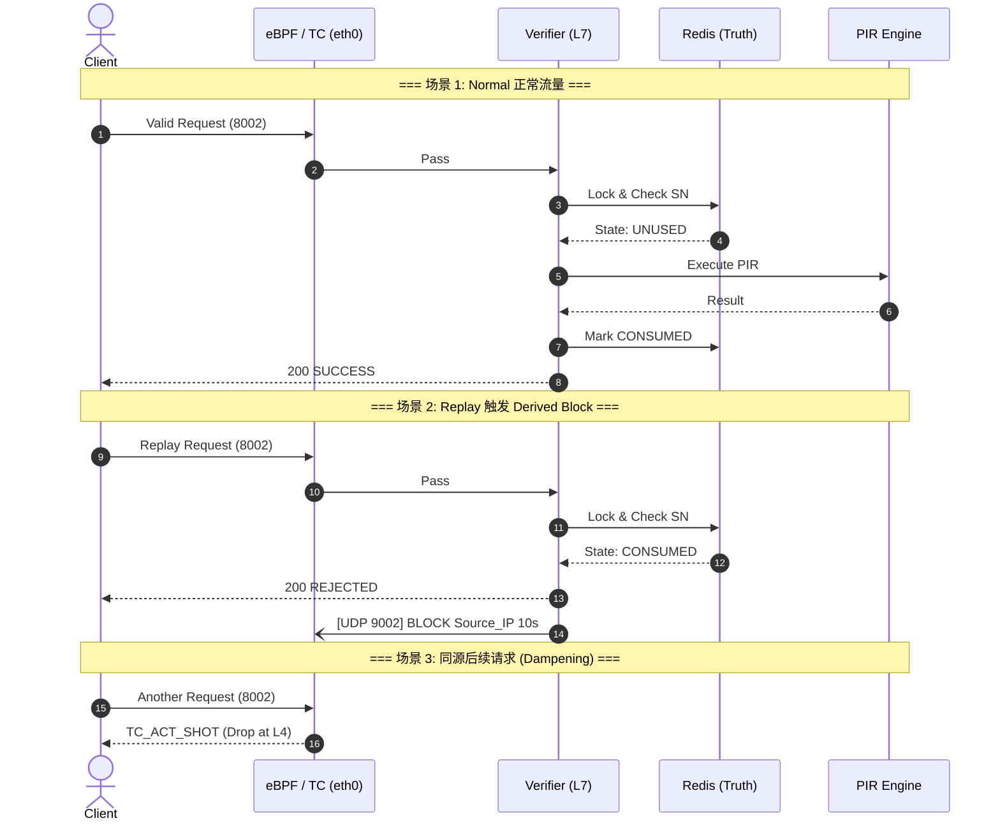

# 两级前置验证与防御架构 (Two-Level Defense Architecture)

## 1. 背景与目标
在匿名信息检索（PIR）系统中，底层的密码学计算（如 SimplePIR）消耗极大的 CPU 和内存资源。如果让恶意流量、重放攻击或格式错误的垃圾数据直接触达 PIR 引擎，将导致严重的资源枯竭（DoS）。
为此，本系统设计了 **L4 (eBPF/TC) + L7 (FastAPI/Redis)** 的两级前置防御架构。其核心目标是：**将防线尽可能前置，以最低的计算代价尽早丢弃非法流量，确保进入 PIR 引擎的都是纯净、合法的请求。**

---

## 2. 两级前置验证总览

本系统将防御链条分为两层：**Fast Path** (内核态快速路径) 和 **Full Path** (用户态全量路径)。


```mermaid
graph TD
    Client[Client 客户端] -->|TCP Traffic| eth0{eBPF / TC Gateway<br/>(Fast Path, dport=8002)}
    
    subgraph Kernel Space
        eth0 -.->|Static HACK| DROP[TC_ACT_SHOT (Drop)]
        eth0 -.->|IP in Blocklist| DROP
    end

    eth0 -->|TC_ACT_OK| Uvicorn[Uvicorn / FastAPI<br/>(Port 8002)]
    
    subgraph User Space
        Uvicorn --> Verifier[Verifier Logic<br/>(Full Path)]
        Verifier <-->|Atomic Lock/Check| Redis[(Redis<br/>Source of Truth)]
        Verifier <-->|Valid Request| PIR[PIR Server]
        
        Verifier -.->|Replay Detected<br/>Fire & Forget| UDP[UDP 9002<br/>Control Plane]
    end
    
    UDP -.->|Sync BPF Map| eth0
```

---

## 3. Fast Path (eBPF / TC) 职责与边界
**定位**：轻量级、无业务状态的网络层 Fast Path 执行器。
**职责**：
* **静态指纹拦截**：直接在网卡层（clsact ingress）丢弃带有明显恶意特征的流量（如 Payload 前缀为 HACK 的字节流）。
* **派生状态拦截 (L4 Dampening)**：执行从控制面下发的来源级 IP 短时封禁指令。当前动态 Blocklist 仅在目标端口 8002 的 Verifier 入口前生效，不干扰 Issuer 8001 的正常发券链路。
**绝对边界**：
* eBPF **绝不**进行深度的 JSON/HTTP 协议解析。
* eBPF **绝不**维护或理解 Ticket 的业务状态（如 UNUSED / CONSUMED），它不单独伪造业务决策。

---

## 4. Full Path (Verifier / Redis / PIR) 职责与边界
**定位**：完整的业务逻辑、状态机与密码学校验中心。
**职责**：
* **Schema / request-shape 校验**由 FastAPI/Pydantic 与 Verifier 路由层共同承担对候选请求结构的第一层过滤。对不满足请求模型的输入可能产生 422；对已进入业务路由但缺失关键材料（如缺票据）的请求，则返回 200 + REJECTED。
* **密码学验证**：验证盲签名（Blind RSA）有效性及上下文绑定标签（Binding Tag HMAC）一致性。
* **状态核销**：基于 Redis 原子锁防御双花与重放攻击。
**绝对边界**：
* 只有完美通过上述所有验证的请求，才会被放行至后端的 PIR Server。

---

## 5. 核心联动逻辑：Source of Truth 与派生关系
本架构确立了严格的主从同步关系：
* **Source of Truth (真相源)**：**Redis 依然是票据状态的唯一真相源**。业务层的核销、拦截决策 100% 由 state_manager.py 依据 Redis 状态做出。
* **Derived Block (派生拒绝)**：当 Verifier 明确判定某次请求属于重放攻击（当前仅在命中 CONSUMED 状态时触发）时，会向本机的 UDP 9002 端口派发一个短时的来源级封禁信号。
* **逻辑收口**：PENDING 与 FAILED 分支当前仍只返回业务拒绝，不派生来源级 L4 Block。eBPF 的 BPF Map 仅作为 CONSUMED 状态下“派生拦截动作”的临时执行缓存。

---

## 6. 典型交互时序图

以下时序图展示了正常请求与重放攻击引发派生封禁的联动流程：



---

## 7. 漏斗效果与统计口径 (Day 41 结论)
以下口径与落点分析基于 Day 41 的验证结果。两级防御架构形成了梯队分明的流量漏斗效应。
**各层级漏斗落点分析**：
* **静态恶意指纹流量（如 HACK）**：在当前受控实验中稳定命中 eBPF 前置丢弃路径，静默拦截。
* **无票据候选流量**：穿透 eBPF，但在 Verifier L7 业务层被前置规则引擎准确阻挡（返回 200 + REJECTED）。
* **重放风暴 (Replays)**：首个请求进入 Verifier 被状态机识别并拒绝；后续重放大多被 eBPF Derived Block 提前抑制。
* **正常流量**：稳定穿透前置防线，经过 Verifier 完整校验后进入 PIR 执行路径，并返回成功结果。

---
## 8. 体系关联说明
本架构文档与其它专项文档互补：
**eBPF 职责边界 (ebpf_scope.md)**：定义底层 TC 过滤的技术实现。
**整体请求时序 (sequence.md)**：描述系统跨组件的交互逻辑。
**本文聚焦**：两级前置验证的分层防御、联动逻辑与 Source of Truth 派生关系。
---

## 9. 当前限制与说明
1. **拦截粒度**：当前 Derived Block 是来源级、短时、粗粒度的 L4 Dampening，而非票据级状态下沉。
2. **触发条件**：当前第一版仅在 Verifier 命中明确的 CONSUMED replay 分支时派生来源级短时 L4 Block；PENDING 与 FAILED 当前仍只返回业务拒绝。
3. **统计近似**实验报告中的 eBPF Drop 数是基于发包与接收差值的合理近似，假设零外部网络损耗。